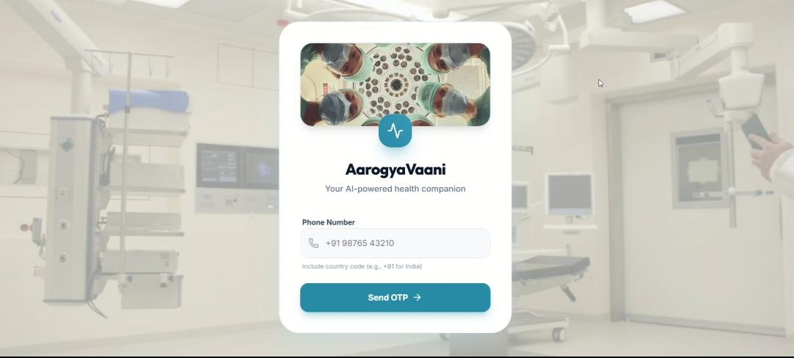
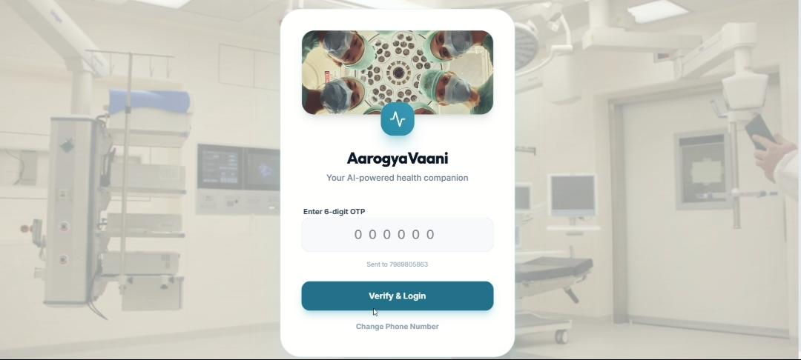
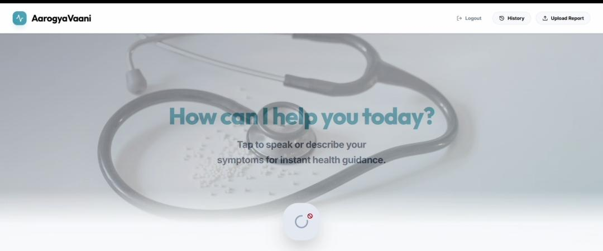
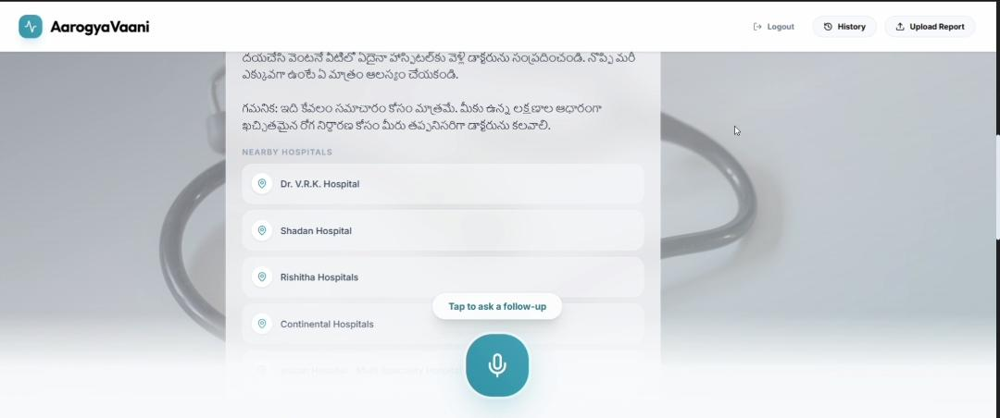

# 🩺 AarogyaVaani – AI Healthcare Assistant

A voice-first AI-powered healthcare assistant for symptom checking, secure login, and medical interaction with history tracking.

---

## 🚀 Tech Stack

* **Frontend:** React + Vite
* **Backend:** Node.js (TypeScript)
* **Authentication:** Twilio OTP (SMS-based login) + JWT
* **AI Integration:** Gemini API
* **Storage:** CSV / Local storage (for user history)
* **Config:** Firebase Applet + Metadata JSON

---

## 📁 Project Structure

```
aarogyavaani/
│── src/                      # Frontend
│── index.html               # Entry file
│── server.ts                # Backend (API + OTP + AI logic)
│── metadata.json            # App config
│── firebase-applet-config.json
│── package.json
│── vite.config.ts
│── .env                     # Secrets (API keys)
```

---

## ⚙️ Run Locally

### 1️⃣ Install dependencies

```bash
npm install
```

---

### 2️⃣ Setup environment variables

Create a `.env` file:

```env
GEMINI_API_KEY=your_gemini_api_key

TWILIO_ACCOUNT_SID=your_twilio_sid
TWILIO_AUTH_TOKEN=your_twilio_token
TWILIO_PHONE_NUMBER=your_twilio_number

JWT_SECRET=your_jwt_secret_key
```

---

### 3️⃣ Start the app

```bash
npm run dev
```

---

## 🔐 Features

* 🔑 **OTP-based Login (Twilio + JWT)**

  * Secure phone number authentication
  * JWT-based session management

* 🧠 **AI Symptom Checker**

  * Powered by Gemini API
  * Provides basic medical insights

* 📜 **User History Storage**

  * Stores past interactions & symptoms
  * Helps track user health patterns

* 🎙️ **Voice-first Interaction**

  * Uses microphone for input
  * Improves accessibility

* 📍 **Location Access**

  * Enables location-based suggestions

---

## 🔧 Backend Capabilities

* Handles:

  * OTP generation & verification (Twilio)
  * JWT token generation & validation
  * AI API requests (Gemini)
  * User session handling
  * History storage

* Can be extended with:

  * Cloud deployment


## 📸 Screenshots

<h3>🏠 Home Page</h3>
<p align="center">
  
</p>

<h3>🔐 OTP Authentication</h3>
<p align="center">
  
</p>

<h3>🧠 User Dashboard</h3>
<p align="center">
  
</p>

<h3>📜AI Symptom Analysis & Hospital Recommendations / History</h3>
<p align="center">
  
</p>


## 👨‍💻 Author

Venkat Laxmi Gottam

⭐ If you like this project, don’t forget to star the repo!
